# Components

---

## DeploymentSetup

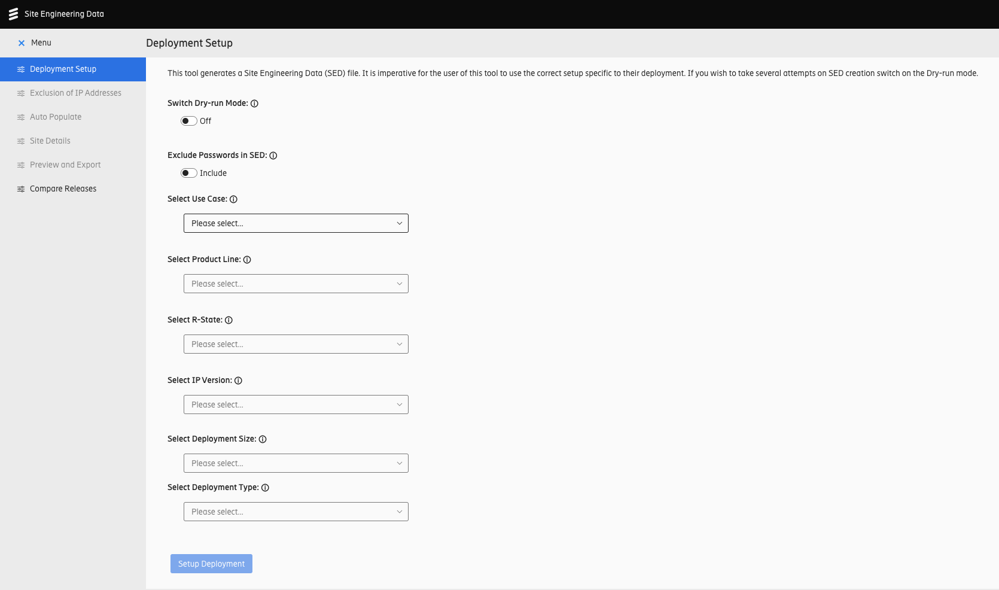

The main component, which is displayed upon navigating to `/deploymentsetup` route.

It prepares reactive model based on the selection of Product, UseCase, Sprint Number, Product Set Version, IP Version, Deployment Size and Deployment Type.

---

## Exclusion of IP Addresses
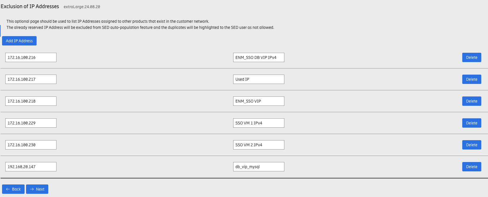

This component is displayed upon navigating to `/excludeipaddresses` route.

It's optional feature used to list IP Addresses assigned to other products that exist in the customer network.
The already reserved IP Address will be excluded from SED auto-population feature and the duplicates will be highlighted to the SED user as not allowed.
---

## AutoPopulate IPs
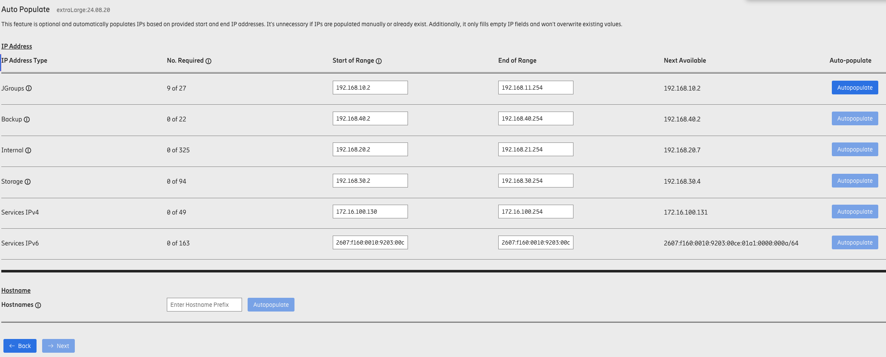

This component is displayed upon navigating to `/autopopulate` route.

This feature is optional and automatically populates IPs based on provided start and end IP addresses. It's unnecessary if IPs are populated manually or already exist. Additionally, it only fills empty IP fields and won't overwrite existing values.

---

## SiteDetails
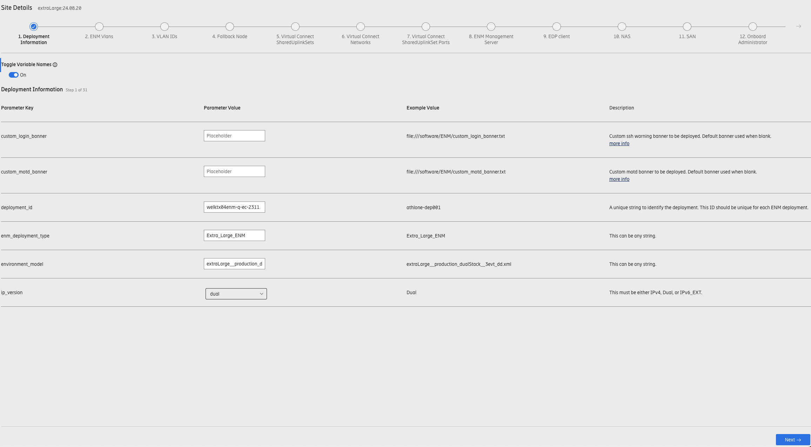

This component is displayed upon navigating to `/sitedetails` route.

It will display all keys, values, Example values, and descriptions in each category in the schema of selected deployment type/size.

---

## Preview Details and Export
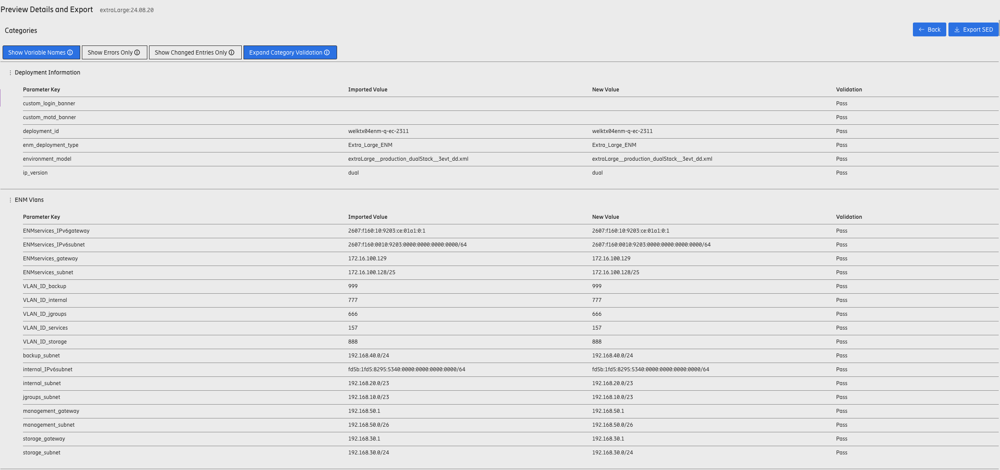

This component is displayed upon navigating to `/previewexport` route.

It will display a full report of all keys, values (imported and new ones), and validation status (Pass or Fail).

---

## Compare Releases
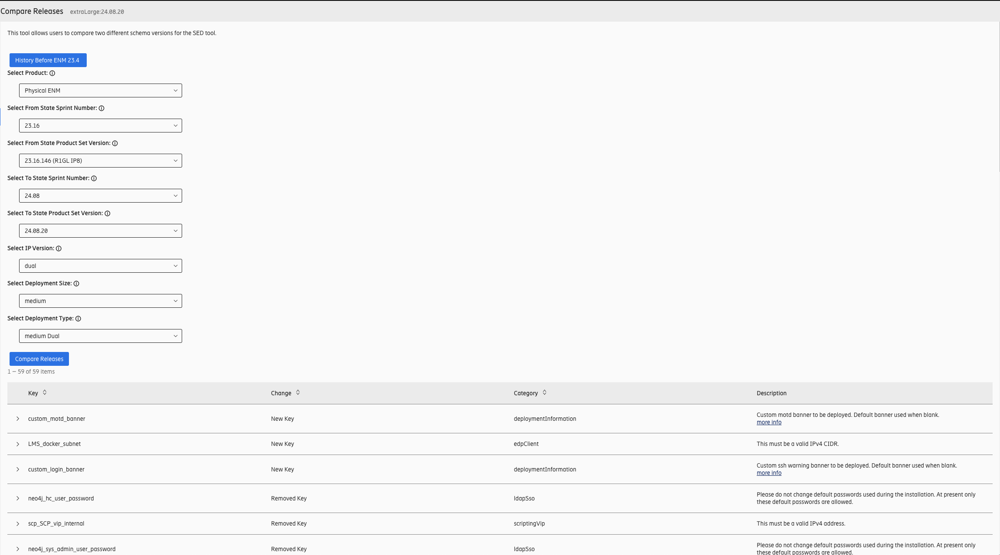

This component is displayed upon navigating to `/compare` route.

This tool/page allows users to compare two different schema versions for the SED tool.

---

## Drop Down Select

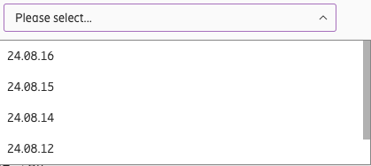

It's a simple wrapper around the drop-down visual of EDS to make it easier to use in Vue.

### Props:
- **options** (Array\<object\>): list of selectable objects
- **displaykey** (string): name of the field, which will be displayed from each item
- **default** (string): name of the field, which will be displayed as selected by default

### Emits:
- **select** (number): the index of the selected item

---

## Array
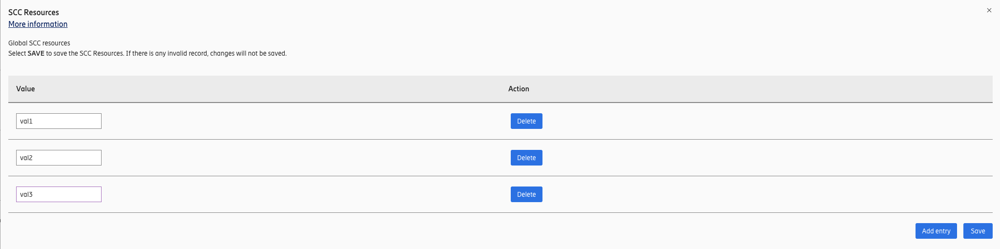

A reusable Array component, which follows EDS style.

---

## ObjectArray
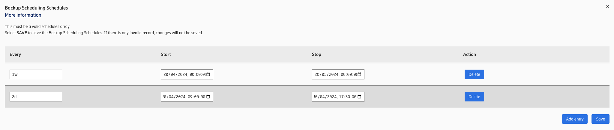

A reusable ObjectArray component, which follows EDS style.

---

## Toleration
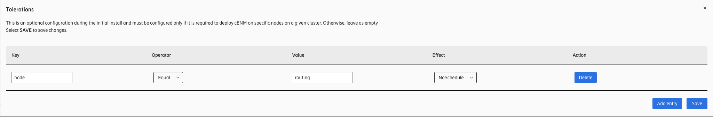

A reusable Toleration component, which follows EDS style.

---

## NodeSelector
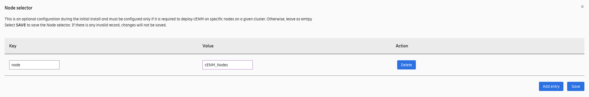

A reusable NodeSelector component, which follows EDS style.

---